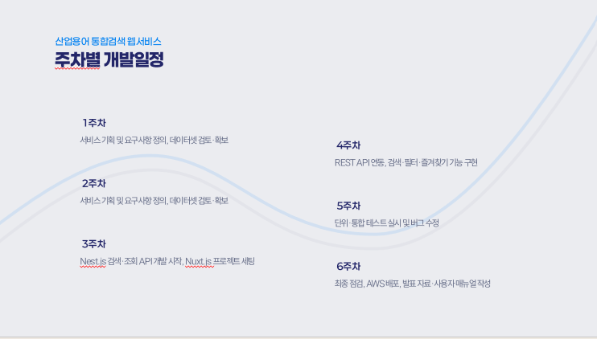

# pnu_datacontest

# 산업용어 통합검색 웹서비스

> **공공데이터를 기반으로 한 산업 · 통상 · 금속 용어 통합검색 플랫폼**  
> 제13회 산업통상자원부 공공데이터 활용 아이디어 공모전 출품작

---

## 🔍 프로젝트 소개

산업 분야에 산재된 전문 용어 데이터를 하나의 플랫폼에서 통합 제공하기 위해 개발된 웹 서비스입니다.  
금속, 통상, 산업 약어 등 3개 분야의 용어를 통합 검색할 수 있으며, 다음과 같은 기능을 제공합니다:

- 분야별 용어 통합검색
- 공식 해설 및 출처 정보 제공
- 분야 필터링 (금속 / 통상 / 산업)
- 즐겨찾기 기능

> 📚 데이터 출처: 산업통상자원부 및 관련 협회에서 공개한 금속표준용어집, 통상용어집, 산업자원용어 해설집

---

## ⚙️ 기술 스택

| 역할       | 기술                        |
|------------|-----------------------------|
| 프론트엔드 |                      |
| 백엔드     |  |
| 데이터베이스 |                   |
| 배포       |                        |

---

## 🧪 주요 API

| Method | Endpoint        | 설명                      |
|--------|------------------|---------------------------|
| GET    | `/api/v1/search` | 통합 용어 검색            |
| POST   | `/api/v1/favorites` | 즐겨찾기 등록         |
| GET    | `/api/v1/favorites` | 즐겨찾기 목록 조회     |
| DELETE | `/api/v1/favorites` | 즐겨찾기 삭제         |

 **Import URL**: https://raw.githubusercontent.com/afkLee/pnu_datacontest/main/swagger.yaml

---
## 🎨 디자인 시안 (Figma)

> 📌 [Figma 디자인 보러가기]([https://www.figma.com/file/your-design-id](https://www.figma.com/design/MR8PTDyiM76EosyiQEA3Kt/%EC%82%B0%EC%97%85-%EC%9A%A9%EC%96%B4-%ED%86%B5%ED%95%A9-%EC%84%9C%EB%B9%84%EC%8A%A4?node-id=5-2825&t=E1OuYoZnQzFGofJb-1))

## 👨‍👩‍👧‍👦 팀 구성

- **문현부**: 백엔드 개발 (NestJS API, DB 설계)
- **이응재**: 프론트엔드 개발 (Nuxt.js UI 구성, DB 설계)

---
## 🗓️ 주차별 개발일정

## 📈 기대효과

- 산업용어 정보의 일관성 확보 및 신뢰도 향상
- 공공데이터의 민간 활용 확산
- 검색 시간 단축과 정보 접근성 향상
- 업무/연구 생산성 증대

---

